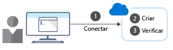

Este módulo explica como usar a CLI do Azure para criar recursos do Azure, executar modelos e detalhar comandos da CLI do Azure.

Objetivos de aprendizagem
Ao final deste módulo, você será capaz de fazer o seguinte:

Criar recursos do Azure usando a CLI do Azure.

Entender a CLI do Azure e trabalhar com ela.

Executar modelos usando a CLI do Azure.

Explicar os comandos da CLI do Azure.

O que é CLI do Azure?

A CLI do Azure é um programa de linha de comando que você usa para se conectar ao Azure e executar comandos administrativos em recursos do Azure.

Ela é executada em sistemas operacionais Linux, macOS e Windows.

Em vez de um navegador da Web, ela permite aos administradores e desenvolvedores executarem seus comandos usando um terminal ou um prompt ou script de linha de comando.

Por exemplo, para reiniciar uma VM, você usaria um comando como:

CLI do Azure

az vm restart -g MyResourceGroup -n MyVm

A CLI do Azure fornece ferramentas de linha de comando multiplataforma para gerenciamento dos recursos do Azure.

Você pode instalá-lo localmente em computadores que executam sistemas operacionais Linux, macOS ou Windows.

Você também pode usar a CLI do Azure em um navegador por meio do Azure Cloud Shell.

Em ambos os casos, você pode usar a CLI do Azure de modo interativo ou por meio de scripts:

Interativo. Para sistemas operacionais Windows, inicie um shell como cmd.exe ou, para Linux ou macOS, use o Bash. Em seguida, emita o comando no prompt do shell.
Com script. Monte os comandos da CLI do Azure em um script de shell usando a sintaxe de script do shell de sua escolha e, em seguida, execute o script.

Criar recursos
Ao criar um recurso do Azure, normalmente, há três etapas de alto nível:

Conecte-se à sua assinatura do Azure.

Crie o recurso.

Verifique se a criação foi bem-sucedida.

Uma ilustração mostra as três etapas para criar um recurso do Azure usando a interface de linha de comando.

1. Conectar
Como está trabalhando com uma instalação local da CLI do Azure, você precisará se autenticar antes de executar os comandos do Azure.

Faça isso usando o comando login da CLI do Azure:

CLI do Azure
<pre>
<code class="language-bash">az login
 </code>
</pre>

Normalmente, a CLI do Azure inicia o navegador padrão para abrir a página de entrada do Azure.

2. Criar
Muitas vezes, você precisará criar um grupo de recursos antes de criar um serviço do Azure.

Portanto, usaremos os grupos de recursos como exemplo para mostrar como criar recursos do Azure usando a CLI do Azure.

O comando group create cria um grupo de recursos da CLI do Azure.

Você precisa especificar um nome e um local.

O parâmetro name deve ser exclusivo dentro de sua assinatura.

O parâmetro location determina onde os metadados para seu grupo de recursos serão armazenados.

Você pode usar cadeias de caracteres como "West US", "North Europe" ou "West India" para especificar o local.

Você também pode usar equivalentes de palavra única, como "westus", "northeurope" ou "westindia".

A sintaxe principal para criar um grupo de recursos é:
<pre>
<code class="language-bash">az group create --name
 </code>
</pre>

3. Verificar a instalação
Para muitos recursos do Azure, a CLI do Azure fornece um subcomando list para obter detalhes do recurso.

Por exemplo, o comando group list da CLI do Azure lista os grupos de recursos do Azure.

É útil verificar se a criação do grupo de recursos foi bem-sucedida:
<pre>
<code class="language-bash">az group list --location
 </code>
</pre>

Para obter informações mais concisas, você pode formatar a saída como uma tabela simples:
<pre>
<code class="language-bash">az group list --output table </code>
</pre>

Usando a CLI do Azure em scripts

Para usar comandos da CLI do Azure em scripts, você precisará estar ciente dos problemas em torno do shell ou do ambiente usado para executar o script.

Por exemplo, em um shell do Bash, você pode usar a seguinte sintaxe ao definir variáveis:
<pre>
<code class="language-bash">variable="value"
variable=integer </code>
</pre>

## Exercício: criar uma máquina virtual

Criar uma máquina virtual no portal do Azure, conectar-se à máquina virtual, instalar a função de servidor Web e teste. 

Liste todos os DataCenters da Azure no Mundo e exporte para datacenter.txt:

<pre>
<code class="language-bash">az account list-locations --output table > datacenter.txt </code>
</pre>

Liste todas as suas Subscrições:

<pre>
<code class="language-bash">az account list --output table </code>
</pre>

Liste todas as imagens Canonical (Ubuntu):

<pre>
<code class="language-bash">az vm image list --publisher Canonical --output table </code>
</pre>

Liste os tamanhos das VMs:

<pre>
<code class="language-bash">az vm list-sizes --location eastus --output table </code>
</pre>

Nota: Você pode substituir eastus pela localização desejada.

Crie o ResourceGroup com o nome 

rg_turma_rmxxxx-SuaSubscriptionId:

<pre>
<code class="language-bash">SUBSCRIPTION_ID=$(az account show --query id -o tsv)
RESOURCE_GROUP_NAME="rg_turma_rmxxxx-$SUBSCRIPTION_ID"
az group create --name $RESOURCE_GROUP_NAME --location eastus </code>
</pre>

Nota: Substitua eastus pela localização desejada e rmxxxx pelo seu identificador.

Crie a máquina virtual e instale o pacote do servidor Web:

<pre>
<code class="language-bash">az vm create \
  --resource-group $RESOURCE_GROUP_NAME \
  --name MyVM \
  --image UbuntuLTS \
  --admin-username azureuser \
  --generate-ssh-keys </code>
</pre>

<pre>
<code class="language-bash">az vm extension set \
  --resource-group $RESOURCE_GROUP_NAME \
  --vm-name MyVM \
  --name customScript \
  --publisher Microsoft.Azure.Extensions \
  --settings '{"commandToExecute":"apt-get update && apt-get install -y apache2"}' </code>
</pre>

Configure o acesso público à máquina virtual criada anteriormente:

<pre>
<code class="language-bash">az vm open-port --port 80 --resource-group $RESOURCE_GROUP_NAME --name MyVM </code>
</pre>

Liste todos os DataCenter da Azure no Mundo e exporte para datacenter.txt:
sh
Copiar código
az account list-locations --output table > datacenter.txt
Liste todas as suas Subscrições:
sh
Copiar código
az account list --output table
Liste todas as imagens Canonical (Ubuntu):
sh
Copiar código
az vm image list --publisher Canonical --output table
Liste os tamanhos das VMs:
sh
Copiar código
az vm list-sizes --location eastus --output table
Crie o ResourceGroup com o nome rg_turma_rmxxxx-SuaSubscriptionId:
sh
Copiar código
SUBSCRIPTION_ID=$(az account show --query id -o tsv)
RESOURCE_GROUP_NAME="rg_turma_rmxxxx-$SUBSCRIPTION_ID"
az group create --name $RESOURCE_GROUP_NAME --location eastus
Crie a máquina virtual e instale o pacote do servidor Web:
sh
Copiar código
az vm create \
  --resource-group $RESOURCE_GROUP_NAME \
  --name MyVM \
  --image UbuntuLTS \
  --admin-username azureuser \
  --generate-ssh-keys

az vm extension set \
  --resource-group $RESOURCE_GROUP_NAME \
  --vm-name MyVM \
  --name customScript \
  --publisher Microsoft.Azure.Extensions \
  --settings '{"commandToExecute":"apt-get update && apt-get install -y apache2"}'
Configure o acesso público à máquina virtual criada anteriormente:
sh
Copiar código
az vm open-port --port 80 --resource-group $RESOURCE_GROUP_NAME --name MyVM
Certifique-se de que o Azure CLI está instalado e autenticado na sua conta Azure antes de executar esses comandos.

