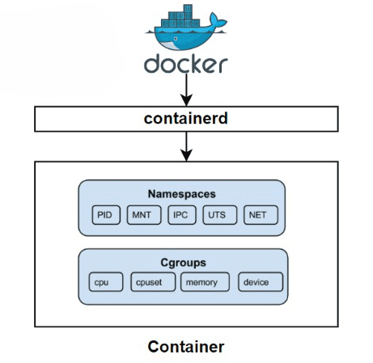
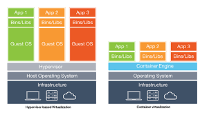

# Porque eu deveria aprender Docker?​

Hoje 4.5 bilhões de containers são rodados. Na indústria mundial algo entre 40% a 70% dos serviços usam containers em produção. Uma das mais rápidas adoções dá história da tecnologia, tendo em vista que Docker foi lançado em março de 2013. ​

​
Esse é um curso INTRODUTÓRIO de Docker nesse curso estaremos explorando a Docker CLI e a utilizaremos para interagir com os objetos container e images. ​

​Aprenderemos tambem como salvar o estado de um container através do uso de volumes. Ao fim do curso apos uma revisao detalhada você tera a chance de validar seus conhecimentos com exercício que tambem sera resolvido durante o curso.​

​No mundo real Containers são aquelas caixas enormes de metal que carregam cargas de todos os tipos. Imagine transportar tantos itens aleatórios sem os Containers? Organizar, manter seguro e agrupado​

​
No contexto da área de tecnologia, um Container parte da mesma ideia do mundo real: Padronizar, isolar e transportar​

# Containers

Containers são tecnologias que nos permitem empacotar e isolar aplicações com seus ambientes de execução por completo,  somado a todos os arquivos necessários para funcionar. Aplicações “Conteinerizadas” facilitam sua movimentação entre ambientes (desenvolvimento, teste, produção, etc) enquanto mantêm o funcionamento completo *Fonte: RedHat​

​
Basicamente é você pegar tudo o que sua aplicação precisa para executar e incluir em um único arquivo. Dessa forma, você garante que a aplicação vai rodar, não importa a versão da tecnologia que você está usando. Se a aplicação está Conteinerizada, qualquer ambiente que suporte container Docker, por exemplo, vai conseguir rodá-la​

Os Containers funcionam como processos no Host​

​O Docker usa o Kernel do Linux e seus recursos para criar processos, esses recursos são: Cgroups, Namespaces​

Containers atingem o isolamento através de Namespaces​

​Compartilhamento e gerenciamento de Memória e CPU através do Cgroups​

# Containers: Image

Um conceito importante ao se falar de Containers são as Imagens ​

​Sendo o container um processo isolado, a imagem é o que dá a esse processo seu Sistema de Arquivos (File System)​

​Por exemplo, comparando com uma Máquina Virtual, nós temos a ISO do Sistema Operacional que desejamos e usamos esse arquivo no VirtualBox ou VMware para subir nosso Sistema Operacional​

​No caso do Docker utilizamos as Imagens para esse fim​

As Imagens são imutáveis, como uma foto, contêm todo o ambiente de execução de um container, suas dependências e binários. Tudo isso junto em um único pacote, e a este pacote damos o nome de Imagem​

# Containers x Virtual Machines​

Vamos iniciar com algumas coisas em comum: ​

​Ambas utilizam a Tecnologia de Virtualização​

Uma máquina hospedeira (é a máquina pela qual as máquinas virtuais e/ou os containers executam)​

​O que muda é a forma como é feita a Virtualização, os Containers não utilizam Hypervisor como as Máquinas Virtuais, e sim os recursos do Sistema e Processos de Kernel para criar os ambientes

