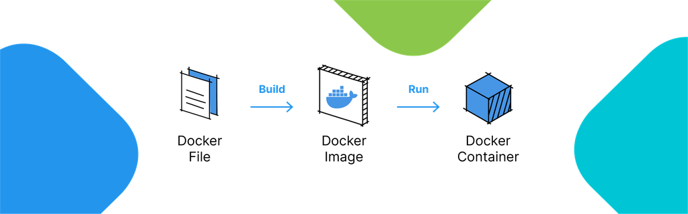
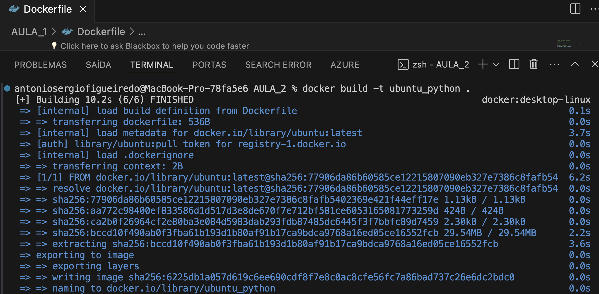

A interface de linha de comando (CLI) é uma forma manual de realizar a administração. Visto em nossos exemplos não é complexo fazer o pull, run, ps e stop de uma Imagem​

​Porém podemos automatizar o processo utilizando Dockerfiles. Esses arquivos nada mais são do que listas de instruções utilizados para automatizar a criação e configuração de Containers​

​Em outras palavras, ele serve como uma receita para construir um Container, permitindo definir um ambiente personalizado

No exemplo abaixo temos o fonte de um Dockerfile simples, que realiza alguns dos passos que já executamos em nossos exemplos​

## Instrução FROM​

É obrigatória e define qual será o ponto de partida da Imagem que criaremos com o nosso Dockerfile​

## Instrução RUN​

Pode ser executada uma ou mais vezes e, com ela, podemos definir quais serão os comandos executados na etapa de criação de camadas da Imagem​

Crie um arquivo com o fonte em sua Home, no Sistema Operacional, e salve como Dockerfile  (sem extensão)​

Agora que escrevemos um Dockerfile, iremos construir uma imagem a partir dele executando o comando docker build, e, por fim, criar e rodar um Container com o comando docker container run​

​“O Container é o fim enquanto a Imagem é o meio”​

## docker build -t ubuntu_python .

Note que o  nome da imagem "ubuntu_python" pode ser alterado para algo mais significativo para voce  ou para seu projeto​
-t : Especifica o nome da imagem que será gerada a partir do Dockerfile​

Pontos importantes:

1. O diretório atual quando executar esse comando precisa conter um Dockerfile;
2. Ao finalizar a execução do comando, você terá uma imagem chamada "ubuntu_python" na lista de suas imagens locais;
2. Ao finalizar a execução do comando, você terá uma imagem chamada ubuntu_python;
3. Se já existir uma imagem com o mesmo nome, essa imagem antiga será apagada.

## docker images

Lista todas as imagens disponíveis no computador.

# Rodando Container Docker com a Imagem recém criada
## docker run -it --name my_ubuntu_python ubuntu_python /bin/bash

-i : Abre a interface interativa do terminal;
-t : Além de mapear a porta STDIN/STDOUT/STDERR entre o host e o container, também mapeia a TTY do container para
-t : Além de abrir a interface interativa do terminal, também cria uma TTY (teclado virtual);
--name : Define o nome do container;
/bin/bash : Comandos para rodar dentro do container.

Se não usar os parâmetros -i e -t, basta digitar /bin/bash sem nada antes. 

Após alguns segundos, você verá algo assim:

